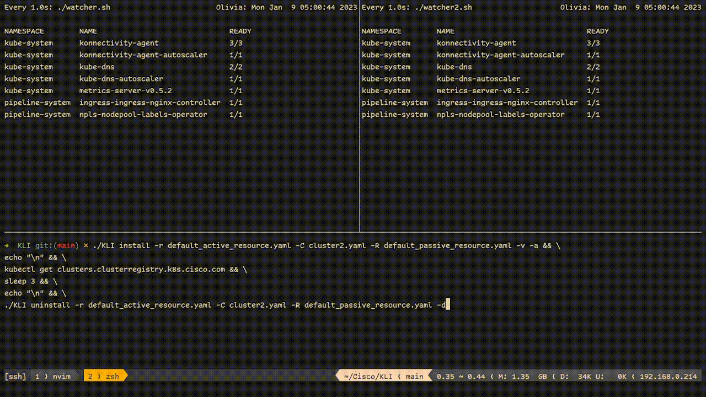

# Overview

KLI is a a CLI front-end for kubereflex.
This CLI helps you automatize some kubernetes releated tasks, so you can focus on what really matters.

At current stage the CLI can:
- install istio-operator and cluster-registry helm chart from banzaicloud to both cluster
- verify deployment readiness after the helm chart install with timeout option
- apply istio control plane CRD (custom resource definition)
- get secret and clusters resource from cluster and create these on different cluster

- uninstall istio-operator and cluster-registry helm chart from both cluster
- delete istio control plane CRD (custom resource definition)
- delete secret and clusters resource from both cluster

The project is in early stage in development therefore bugs and unexpected behaviors may be present.

## How to build and use it

Dependency for build:
- go-lang from [https://go.dev/](https://go.dev/)

Step 1.
``` git clone https://github.com/arpad-csepi/KLI.git && cd KLI/ ```
or
Download the repository as a zip file, extract it to a new folder and open a terminal inside that folder

Step 2.
``` go build ```

Step 3.
``` ./KLI install for install kubernetes stuff ```
``` ./KLI uninstall for uninstall kubernetes stuff ```

### Flags

Every flag has a default value, some flag default value can be valid therefore optional to write down.

For install and uninstall command:
--main-cluster [filepath] or -c [filepath]
This flag set the primary kubernetes config up.
The filepath can be relative and absolute path for a kubernetes cluster yaml config file.
If filepath not provided, then $HOME/.kube/config will be used.
Default value: ""

> Example: ``` ./KLI install ($HOME/.kube/config will be used as --main-cluster value) ```

--secondary-cluster [filepath] or -C [filepath]
This flag set the secondary kubernetes config up.
The filepath can be relative and absolute path for a kubernetes cluster yaml config file.
Filepath cannot be empty.
Default value: ""
Must be use with:
- --main-cluster or -c

> Example: ``` ./KLI install -C cluster2.yaml (cluster2.yaml in the same directory as KLI) ```

--active-custom-resource [filepath] or -r [filepath]
This flag set a custom resource definition up to the primary cluster.
The filepath can be relative and absolute path for a kubernetes cluster yaml config file.
Filepath cannot be empty.
Default value: ""
Must be use with:
- --main-cluster or -c

> Example: ``` ./KLI install -c cluster.yaml -r crd.yaml (cluster.yaml and crd.yaml in the same directory as KLI) ```

--passive-custom-resource or -R
This flag set a custom resource definition up to the secondary cluster.
The filepath can be relative and absolute path for a kubernetes cluster yaml config file.
Filepath cannot be empty.
Must be use with:
- --main-cluster or -c
- --secondary-cluster or -C

> Example: ``` ./KLI install -C cluster2.yaml -R crd2.yaml (cluster2.yaml and crd2.yaml in the same directory as KLI) ```

For install command:
--attach or -a
This flag syncronize some resources between two kubernetes cluster.
If this flag written down, then will change the value to true.
Default value: false

> Example: ``` ./KLI install -r crd.yaml -C cluster2.yaml -R crd2.yaml -a ($HOME/.kube/config will be used as --main-cluster value) ```

--verify or -v
This flag verify the deployment readiness after helm chart install.
If this flag written down, then will change the value to true.
Default value: false

> Example: ``` ./KLI install -v ($HOME/.kube/config will be used as --main-cluster value) ```

--timeout or -t
This flag set a timeout time in seconds for the verify process.
Default value: 30

> Example: ``` ./KLI install -v -t 60 ($HOME/.kube/config will be used as --main-cluster value) ```

For uninstall command:
--detach or -d
This flag delete some resources between two kubernetes cluster.
If this flag written down, then will change the value to true.
Default value: false

> Example: ``` ./KLI uninstall -r crd.yaml -C cluster2.yaml -R crd2.yaml -d ($HOME/.kube/config will be used as --main-cluster value) ```

### Demo


